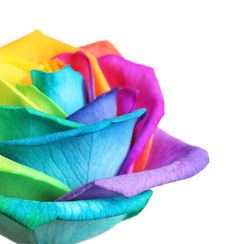
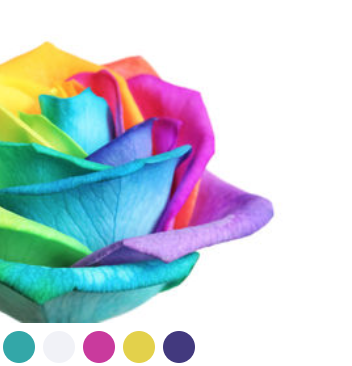
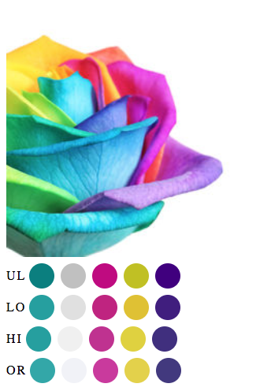

# Coloroscopy 🌈

Coloroscopy is a tool that indexes images with color profiles of various resolutions.  It also provides utility functions to help in querying the color profiles to find the best matches.

#### Profiling Images

The main function of the service is to provide an accurate color profile for images. Here's how it works:

######1. A single image is posted to the service 
  

######2. A baseline color profile identifies the five prominent colors.
  

Now that we've identified the five prominent colors, we want to identify which 'regions' of the color spectrum these belong to. This will help us provide low and high resolution relative search results.

For example, if we profiled the image with only these five exact hex values, then the user would have to search *exactly those values to get results*. This is not ideal, therefore we want to create different resolutions in our color profile.

######3. Create Resolution profiles
Using the 5 prominent colors, we then go and map each color to a 'region' size on the entire color spectrum. Essentially, this takes the original color and expands its potential across the spectrum. The bigger the 'region', the more colors inside of it. Let's look at an example.

Let's say our picture contains a certain red, `#EE2C0E`

Now, if we want to expose this picture and the fact that it contains 'red', we want to ensure that when the user queries a red that's **close enough**, we return this picture as a relevant result.

To accomplish this, we take the `RGB` values and expand their potentail scope, which in effect 'zooms out' from the original color and creates a 'boundary' within which it belongs.

When we run this red through our `low-resolution` profile, we get this 'region' of reds:

There are many hex values within this zone, thus making it *lower* resolution. Higher resolution would mean less color variation within the zone.

**What this allows us to do for the user** 🥁🥁🥁
If they query any red within this zone, they will match on our picture ✅

What this does for our image colors is to create meaningful zones within which each color belongs. Eventhough our image is originally profiled with five specific baseline colors, we can expand the scope of each of those colors to include nearby relevant color values.  

In the interest of both flexibility and precision, we create several color profiles, ranging from low to high to original resolution. This way we can arrange matches that are extremely close, or close enough, depending on what we want to present.

######3. Exploring Different Profiles

The easiest way to visualize the different color profile resolutions is to reference our original image, with the profiles displayed below:

Here we have four profiles on display:
- **OR**: Original five baseline colors
- **HI**: High-Resolution profile
- **LO**: Low-Resolution profile
- **UL**: Ultra-Low Resolution profile

*The colors on display represent the lower-boundary of their given color zones.*

Notice that as the resolution gets lower, the color seems to stray further away from the original. This is the intention as the low-resolution profiles capture many colors within their zones, and the high/original profiles are very specific. This gives us many options in structuring our queries and search results.
